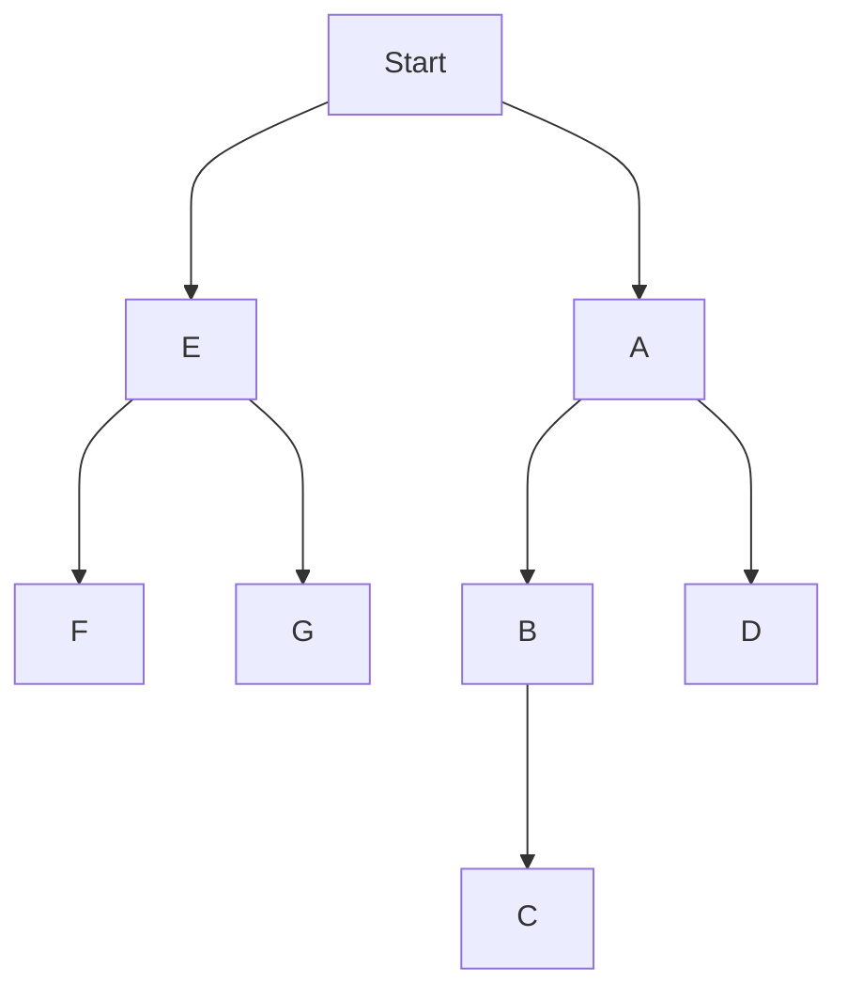

## 给予data sctructure
```
const tree = [
    {
        val:'a', 
        children:[
            {
                val:'b', 
                children:[
                    val:'c',
                    children:[]
                ], 
            },
            {
                val:'d', 
                children:[], 
            }
        ], 
    }, 
    {
        val:'e',
        children:[
            {
                val:'f', 
                children:[], 
            },
            {
                val:'g', 
                children:[], 
            }
        ]
    }
]
```




## 广度优先遍历 
